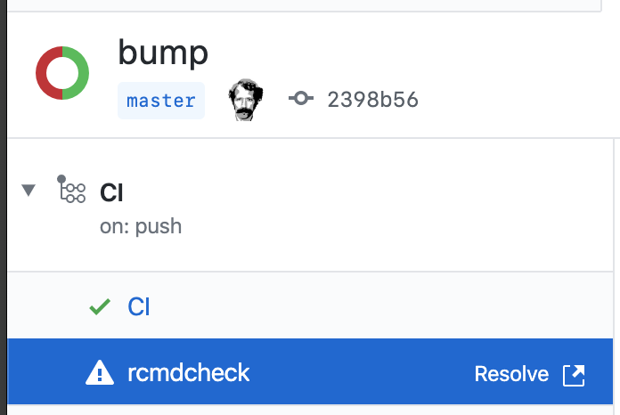

# rcmdcheck-action

WIP Action for structured `R CMD CHECK` output.

## TODO

- Refactor to integrate into pipelines rather than having this be a standalone Action using a custom image. i.e., we should be able to run this with multiple versions of R on multiple platforms out of the box

## Summary

As of writing, the available Actions for running `R CMD CHECK` against your R packages will error on warnings or errors, but you end up having to scan the raw log to get the errors.

GitHub provides a [Checks API](https://developer.github.com/v3/checks/) that lets us display the results of `R CMD CHECK` in a structured manner:

**As a separate line item in our Actions...**

**with Markdown-formatted details...**

